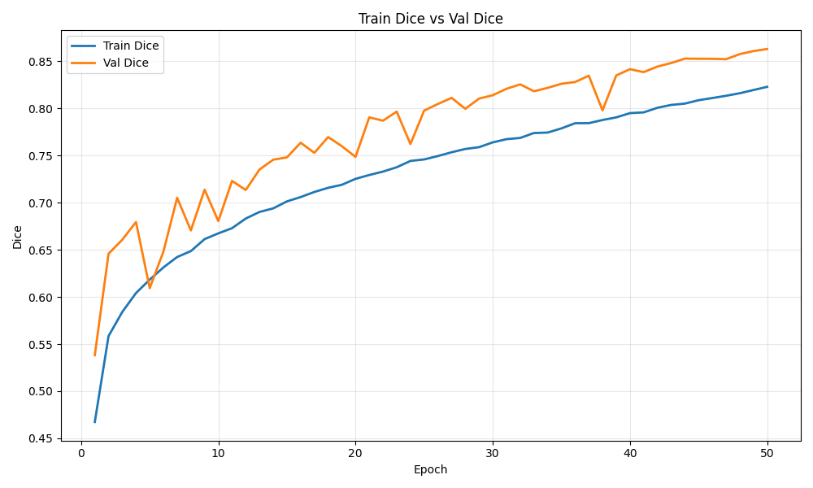
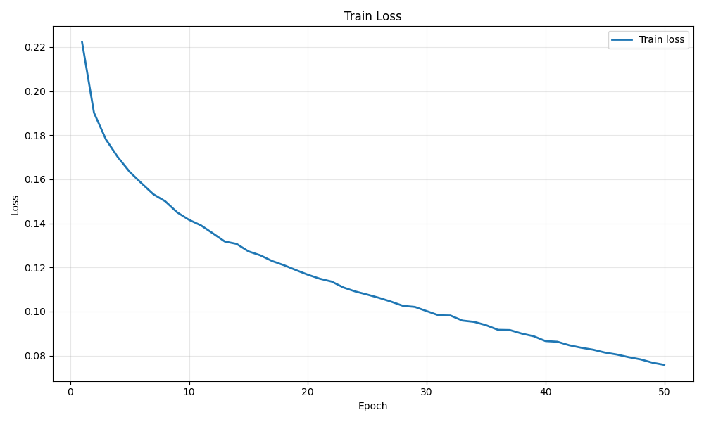
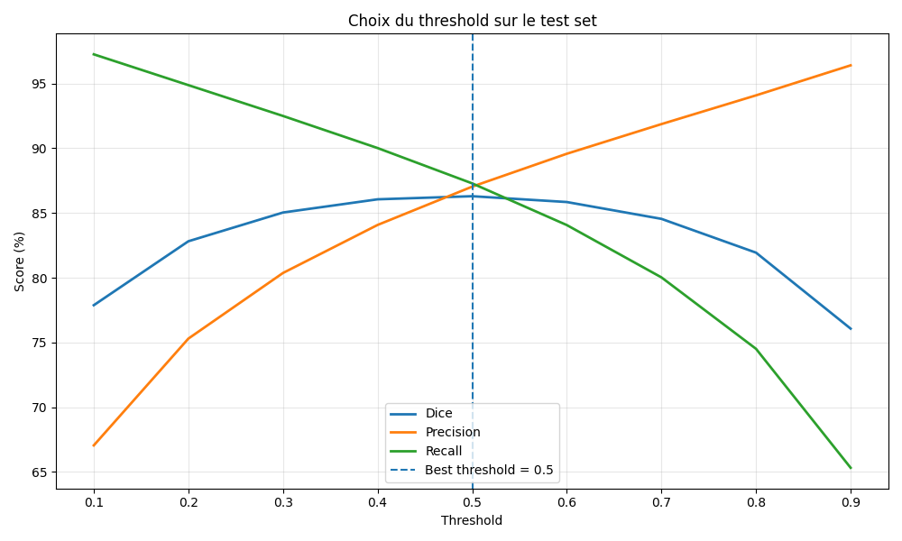
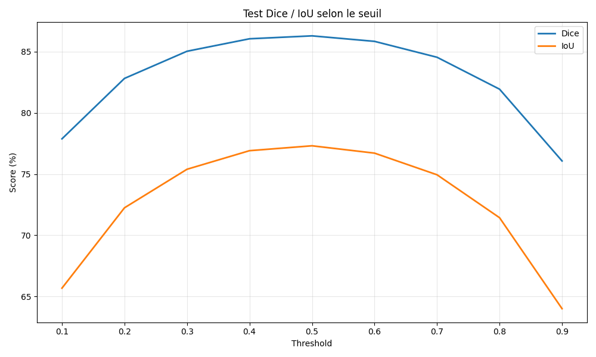
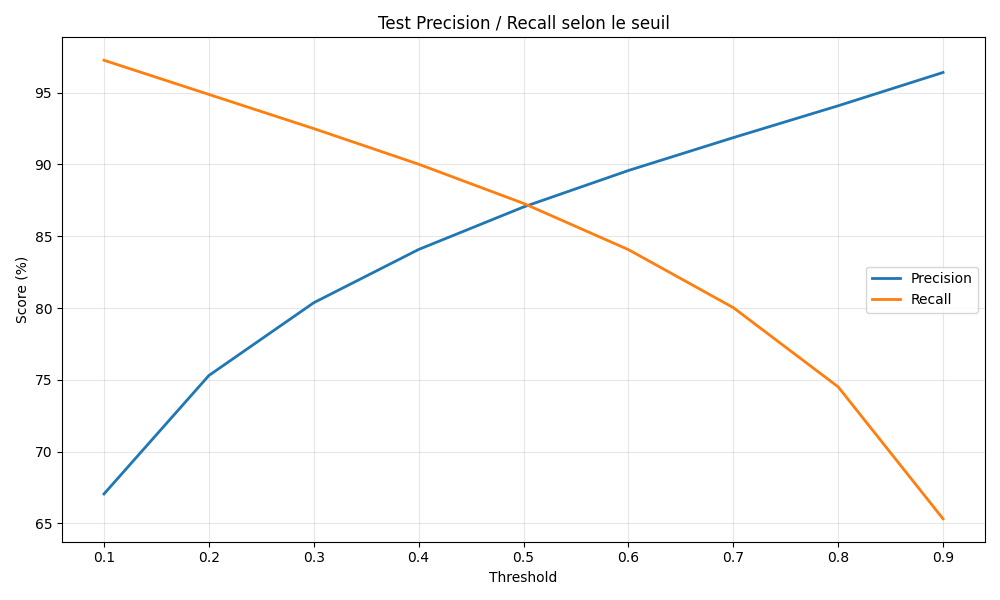
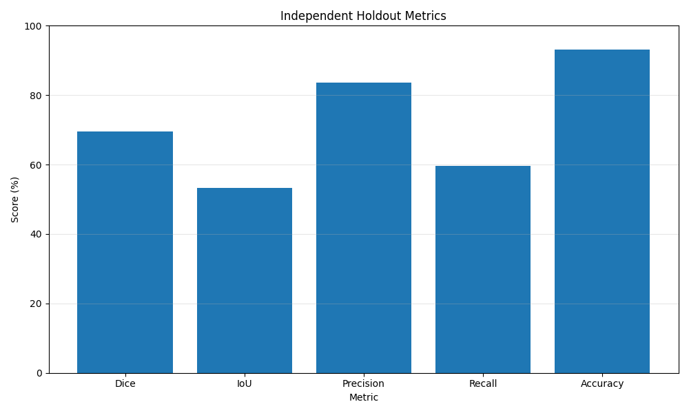
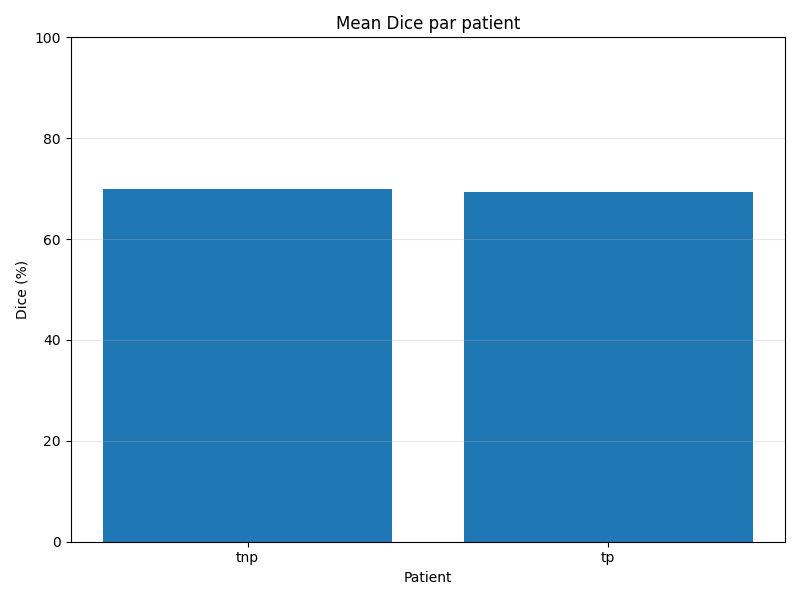

# Frame-Mix Protocol (Baseline)

---

## 1. Performance Summary

Training with the **Frame-Mix protocol** (random image-level split) produces **overly optimistic metrics** that collapse when evaluated on independent patients.

| Metric     | Internal Test Set | Independent Holdout | Delta |
|------------|------------------|--------------------|--------|
| Dice       | 86.30%           | 69.57%             | -16.73% |
| IoU        | 77.31%           | 53.34%             | -23.97% |
| Precision  | 87.04%           | 83.67%             | -3.37%  |
| Recall     | 87.29%           | 59.54%             | -27.75% |

---

## 2. Training Dynamics (curves/)

### Dice Evolution

### Loss Evolution

### Key Observation

- Epoch 1:
  - Train Dice: 0.4674  
  - Val Dice: **0.5382 (already higher than train)**  

- Epoch 50:
  - Train Dice: 0.8228  
  - Val Dice: **0.8629**

### Interpretation

- Validation curve is consistently **above or equal to training**
- This indicates **data leakage due to temporal correlation**
- The model is memorizing instead of learning generalizable features

---

## 3. Threshold Analysis (threshold_analysis/)

### Dice vs Threshold

### IoU vs Threshold

### Precision / Recall Trade-off

### Key Signals

- Plateau between **0.3 → 0.6**
- Best Dice at threshold **0.5 = 86.30%**
- Recall reaches **97.26% at threshold 0.1**

### Interpretation

- Artificial stability across thresholds  
- The model already "knows" the test distribution  
- Strong indicator of leakage

---

## 4. Independent Holdout Evaluation

### Global Metrics Visualization

### Mean Dice Distribution

### Metrics

- Dice: 69.57%  
- IoU: 53.34%  
- Precision: 83.67%  
- Recall: 59.54%  

### Interpretation

- Precision remains acceptable  
- Recall collapses → large portions of lesions are missed  

---

## 5. Per-Patient Breakdown

| Patient Group | Images | Mean Dice |
|---------------|--------|----------|
| tnp           | 1350   | 69.90%   |
| tp            | 2882   | 69.42%   |

### Observation

- Performance is capped around **~69%**
- Failure is **consistent across patients**

---

## 6. Auditor Conclusion

The Frame-Mix protocol introduces a **temporal memorization bias**.

- The internal score (**86.30% Dice**) is a **statistical artifact**
- The real clinical performance is:

> **69.57% Dice on independent patients**

### Final Insight

The model learned:

- Patient-specific visual signatures  

Instead of:

- Generalizable representations of Crohn’s disease  

This makes the model **clinically unreliable despite strong benchmark results**.

---
