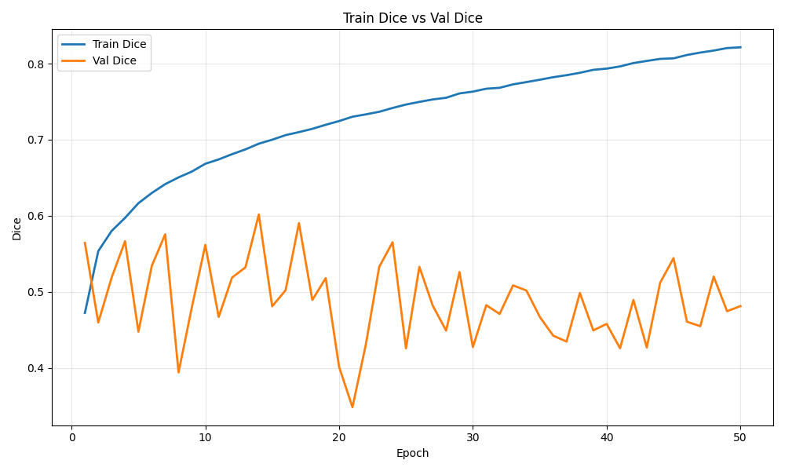
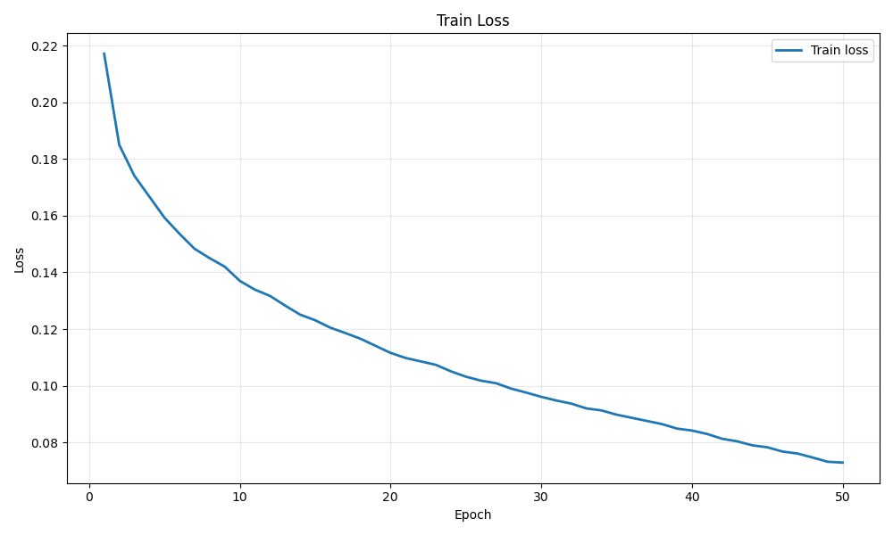
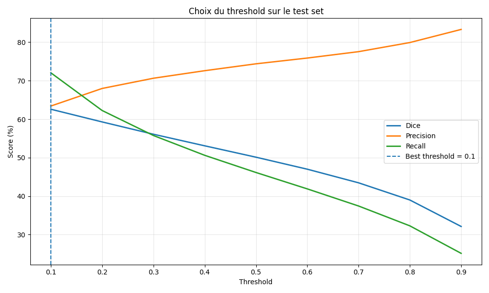
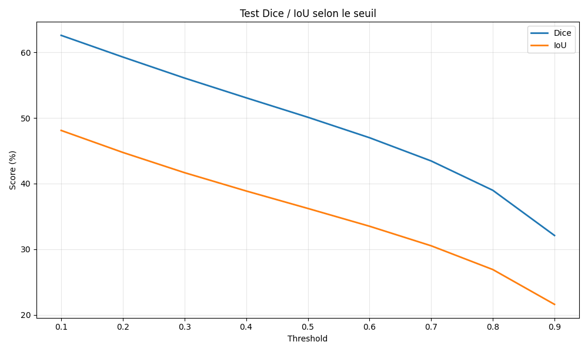
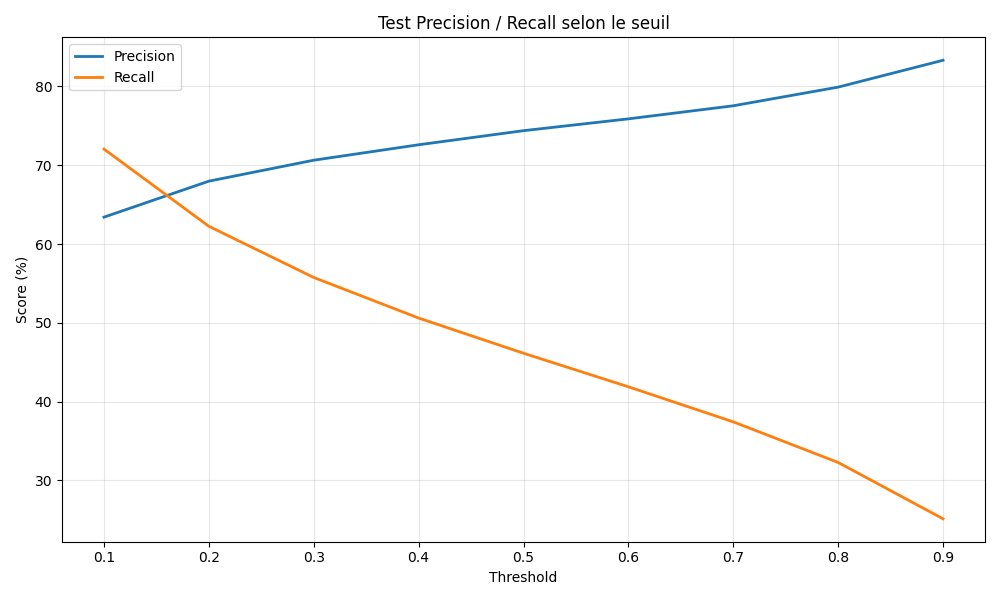
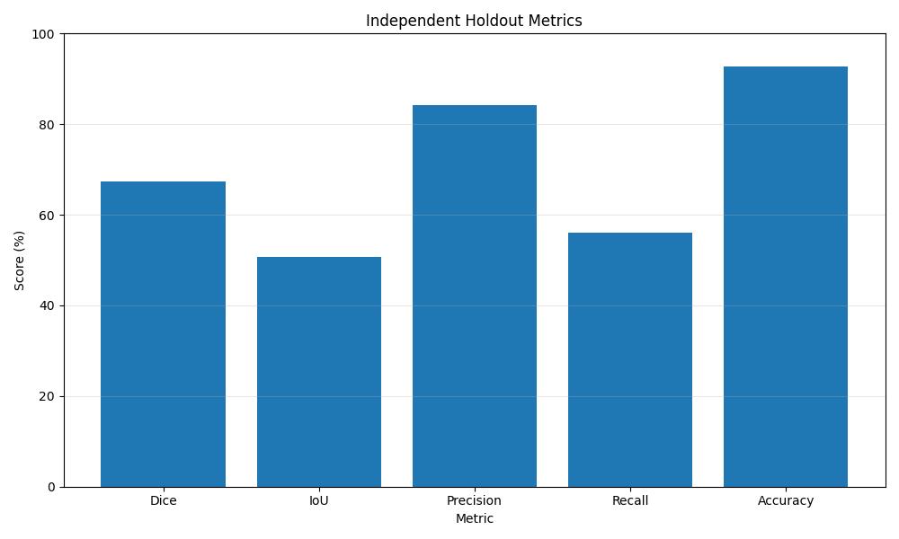
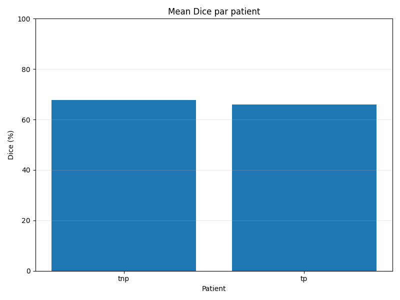

# Patient-Aware Protocol (Baseline)

---

## 1. Performance Summary

Training with the **Patient-Aware protocol** (strict patient/sequence-level split) produces lower internal metrics than Frame-Mix, but shows **stable behavior on independent patients**.

| Metric     | Internal Test Set | Independent Holdout | Delta |
|------------|------------------|--------------------|--------|
| Dice       | 62.58%           | 66.52%             | +3.94% |
| Precision  | 63.41%           | 84.13%             | +20.72% |
| Recall     | 72.05%           | 56.13%             | -15.92% |

---

## 2. Training Dynamics (curves/)

### Dice Evolution

### Loss Evolution

### Key Observation

- Train Dice progresses normally from **~0.47 to ~0.82**
- Validation Dice remains volatile, between **~0.34 and ~0.60**

### Interpretation

- Validation is harder than training
- No patient/sequence overlap exists between splits
- The model cannot rely on temporal memorization
- This behavior reflects a **real generalization constraint**

---

## 3. Threshold Analysis (threshold_analysis/)

### Threshold Metrics

### Dice vs Threshold

### Precision / Recall Trade-off

### Key Results

| Threshold | Dice   | IoU    | Precision | Recall |
|----------|--------|--------|-----------|--------|
| 0.1      | 62.58% | 48.10% | 63.41%    | 72.05% |
| 0.5      | 50.11% | 36.22% | 74.39%    | 46.13% |
| 0.9      | 32.10% | 21.61% | 83.33%    | 25.11% |

### Key Signals

- Best Dice is obtained at threshold **0.1**
- Precision increases as threshold rises
- Recall drops strongly at high thresholds

### Interpretation

- The model is less overconfident than Frame-Mix
- It captures lesions better with a lower decision threshold
- This suggests uncertainty on segmentation boundaries rather than memorization

---

## 4. Independent Holdout Evaluation

### Global Metrics Visualization

### Mean Dice Distribution

### Metrics

- Mean Image Dice: 66.52%
- Pixel Precision: 84.13%
- Pixel Recall: 56.13%

### Interpretation

- Precision remains high
- Recall is moderate
- The model tends to under-segment rather than over-segment

---

## 5. Per-Patient Breakdown

| Patient Group | Mean Dice |
|---------------|----------|
| TNP           | 67.76%   |
| TP            | 65.94%   |

### Observation

- Performance remains close across patient groups
- No catastrophic collapse on independent data
- The model shows stable generalization behavior

---

## 6. Auditor Conclusion

The Patient-Aware protocol provides a **stricter and clinically more reliable evaluation**.

- Internal performance is lower than Frame-Mix
- Holdout performance remains stable
- No temporal leakage is observed

### Final Insight

The model learned:

- More generalizable disease-related patterns

Instead of:

- Patient-specific visual signatures

This makes the Patient-Aware protocol a more trustworthy estimate of real clinical performance.

---
