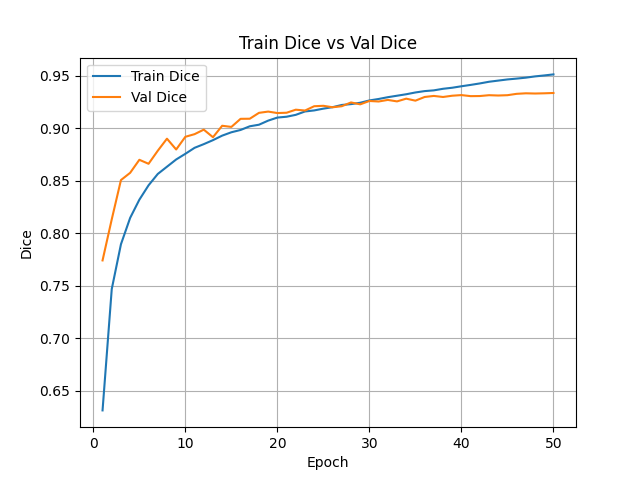
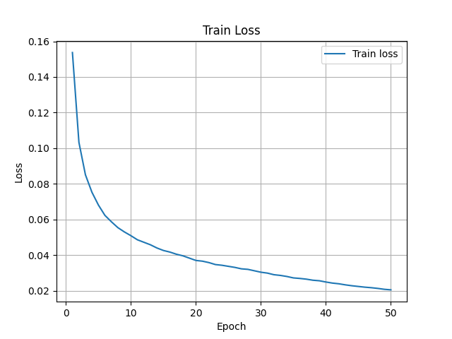
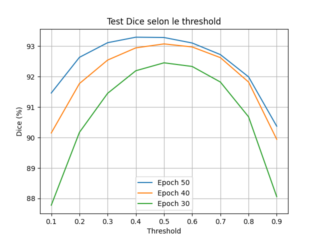
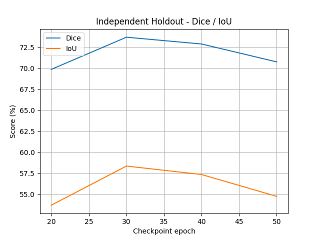
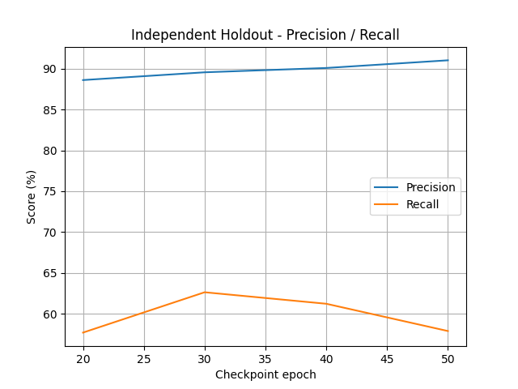

# Frame-Mix Protocol on "Robust" TransUNet

---

## 1. Performance Summary

The **standard TransUNet architecture (ResNetV2 + ViT)** was trained using a **Frame-Mix protocol**, where frames from the same patient/sequence can appear across training, validation, and test sets.

This protocol produces extremely high internal scores, suggesting strong model performance under the biased evaluation setup.

| Evaluation | Epoch 50 | Epoch 40 | Epoch 30 |
|------------|----------|----------|----------|
| Train Dice | 95.13% | 94.00% | 92.65% |
| Val Dice | 93.36% | 93.16% | 92.60% |
| Internal Test Dice | 93.29% (thr=0.4) | 93.07% (thr=0.5) | 92.45% (thr=0.5) |

---

## 2. Training Dynamics

### Dice Evolution

### Loss Evolution

### Key Observation

- Train Dice reaches **95.13%**
- Validation Dice reaches **93.36%**
- Internal test Dice reaches **93.29%**
- Training, validation, and internal test scores remain highly aligned

### Interpretation

The model appears highly effective under internal evaluation.  
However, the close alignment between train, validation, and test performance is consistent with a Frame-Mix split where temporally related frames are shared across sets.

---

## 3. Threshold Analysis

### Dice vs Threshold

### Epoch 50 Threshold Results

| Threshold | Dice | IoU | Precision | Recall |
|----------|------|-----|-----------|--------|
| 0.1 | 91.46% | 84.76% | 86.49% | 97.76% |
| 0.2 | 92.63% | 86.71% | 89.54% | 96.55% |
| 0.3 | 93.11% | 87.54% | 91.40% | 95.46% |
| 0.4 | 93.29% | 87.87% | 92.77% | 94.38% |
| 0.5 | 93.28% | 87.86% | 93.88% | 93.25% |
| 0.6 | 93.10% | 87.57% | 94.86% | 91.98% |
| 0.7 | 92.72% | 86.94% | 95.77% | 90.46% |
| 0.8 | 91.99% | 85.75% | 96.72% | 88.37% |
| 0.9 | 90.37% | 83.16% | 97.82% | 84.77% |

### Key Signals

- Dice remains above **90%** across all thresholds
- Best Dice is obtained at threshold **0.4**
- Precision and recall remain simultaneously high
- The threshold curve is unusually stable

### Interpretation

This threshold stability suggests that the model is very confident on the internal test distribution.  
Under Frame-Mix conditions, this confidence is likely supported by strong visual similarity between training and test frames.

---

## 4. Independent Holdout Evaluation

Evaluation on fully unseen patients reveals a clear drop in performance.

### Independent Dice / IoU

### Independent Precision / Recall

| Epoch | Internal Test Dice | Holdout Mean Dice | Delta | Holdout Precision | Holdout Recall |
|------|--------------------|-------------------|-------|-------------------|----------------|
| 20 | N/A | 68.87% | N/A | 88.61% | 57.69% |
| 30 | 92.45% | 73.66% | -18.79% | 89.56% | 62.63% |
| 40 | 93.07% | 72.24% | -20.83% | 90.09% | 61.22% |
| 50 | 93.29% | 70.17% | -23.12% | 91.03% | 57.88% |

### Key Observation

- Internal Dice increases up to **93.29%**
- Holdout Mean Dice decreases to **70.17%** at Epoch 50
- Precision remains high
- Recall remains much lower than internal evaluation would suggest

### Interpretation

On independent patients, the model remains conservative:

- It avoids many false positives
- It misses a substantial fraction of true lesion pixels
- The main failure mode is under-segmentation rather than over-segmentation

---

## 5. Epoch-Level Generalization Pattern

| Epoch | Internal Test Dice | Holdout Mean Dice |
|------|--------------------|-------------------|
| 30 | 92.45% | 73.66% |
| 40 | 93.07% | 72.24% |
| 50 | 93.29% | 70.17% |

### Observation

From Epoch 30 to Epoch 50:

- Internal test performance improves slightly
- Independent holdout performance decreases

### Interpretation

The best independent generalization is observed at **Epoch 30**.  
Later epochs improve performance mainly on the internal Frame-Mix distribution, while external performance declines.

This indicates progressive specialization to the training/test distribution rather than improved clinical generalization.

---

## 6. Per-Patient Holdout Breakdown

| Epoch | Patient Group | Images | Predicted Positive Images | Mean Dice |
|------|---------------|--------|---------------------------|----------|
| 20 | TNP | 1350 | 1329 / 1350 | 65.59% |
| 20 | TP | 2882 | 2869 / 2882 | 70.40% |
| 30 | TNP | 1350 | 1348 / 1350 | 72.35% |
| 30 | TP | 2882 | 2880 / 2882 | 74.28% |
| 40 | TNP | 1350 | 1333 / 1350 | 70.97% |
| 40 | TP | 2882 | 2872 / 2882 | 72.84% |
| 50 | TNP | 1350 | 1317 / 1350 | 68.65% |
| 50 | TP | 2882 | 2873 / 2882 | 70.88% |

### Observation

Epoch 30 provides the strongest independent holdout performance:

> **73.66% Mean Dice**

After Epoch 30, holdout performance decreases despite continued improvement on internal metrics.

---

## 7. Final Assessment

The Frame-Mix protocol gives this model an inflated internal estimate of performance.

- Internal evaluation suggests near-perfect segmentation
- Independent holdout evaluation reveals a substantially lower real-world performance
- The gap increases with later epochs
- The model becomes progressively more specialized to the Frame-Mix distribution

### True Performance Estimate

> **73.66% Mean Dice at Epoch 30** is the best observed independent generalization point.

---

## 8. Auditor Conclusion

Under the Frame-Mix protocol, the robust TransUNet achieves very high internal scores, but these scores do not transfer to independent patients.

### Final Insight

The model learns highly effective representations for the internal distribution, but the independent holdout shows that its clinical generalization is limited.

The main risk is that the internal score of **93.29% Dice** overstates the model’s real independent performance, which peaks at **73.66% Dice**.

---
