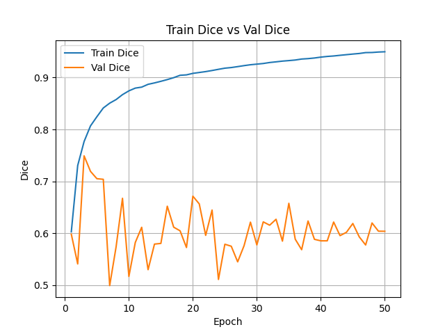
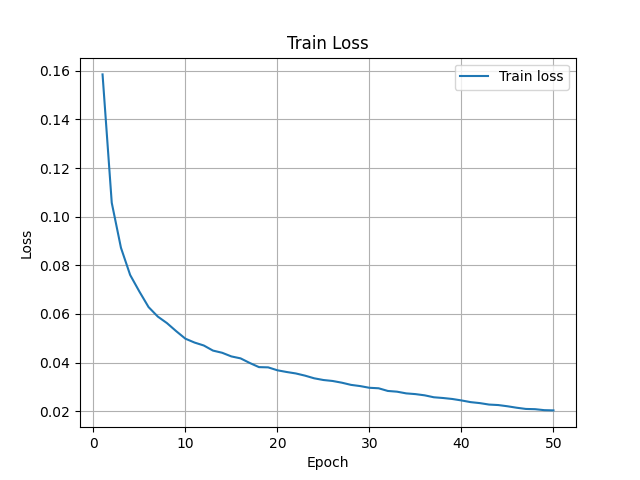
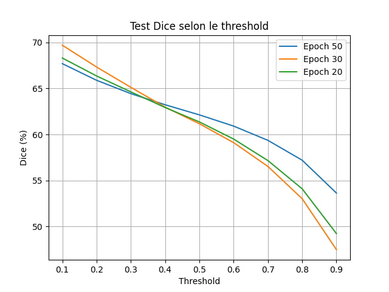
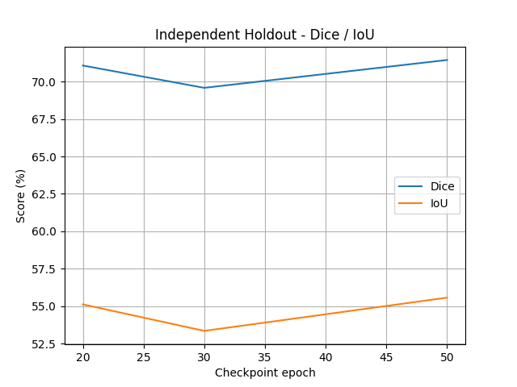
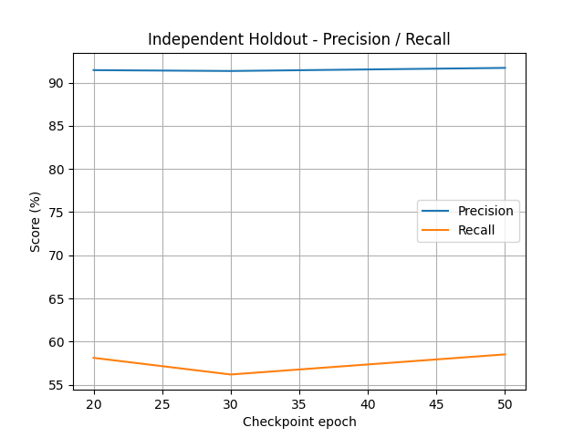

# Patient-Aware Protocol on "Robust" TransUNet

---

## 1. Learning Dynamics: Overfitting Revealed

The **Patient-Aware protocol** exposes the real difficulty of the task.  
Unlike Frame-Mix, no patient/sequence appears across multiple splits.

| Epoch | Train Dice | Val Dice | Gap |
|------|------------|----------|-----|
| 20   | 90.81%     | 67.15%   | -23.66% |
| 30   | 92.59%     | 57.76%   | -34.83% |
| 50   | 94.97%     | 60.39%   | -34.58% |

### Dice Evolution

### Loss Evolution

### Interpretation

The model reaches almost **95% Train Dice**, confirming its high fitting capacity.

However, validation performance remains unstable and far lower than training performance. This indicates:

- Strong overfitting on the training patients
- Limited transfer to unseen anatomies
- No artificial boost from temporal leakage

---

## 2. Internal Test Evaluation

The internal test set provides a realistic estimate because it is separated at the patient/sequence level.

### Dice vs Threshold

| Epoch | Best Threshold | Dice | IoU | Precision | Recall |
|------|----------------|------|-----|-----------|--------|
| 20   | 0.1 | 68.31% | 55.19% | 77.74% | 70.26% |
| 30   | 0.1 | 69.70% | 56.60% | 79.18% | 70.31% |
| 50   | 0.1 | 67.70% | 54.35% | 80.47% | 66.70% |

### Threshold Sensitivity

At Epoch 50, performance decreases as the threshold increases:

| Threshold | Dice | IoU | Precision | Recall |
|----------|------|-----|-----------|--------|
| 0.1 | 67.70% | 54.35% | 80.47% | 66.70% |
| 0.5 | 62.13% | 48.67% | 84.37% | 56.63% |
| 0.9 | 53.63% | 40.49% | 88.23% | 45.18% |

### Interpretation

The optimal threshold is consistently **0.1**, showing that the model is less overconfident on unseen patients.

This behavior reflects uncertainty on lesion boundaries rather than memorization.

---

## 3. Independent Holdout Evaluation

The independent holdout set contains **4,232 images** from fully excluded patients.

### Independent Dice / IoU

### Independent Precision / Recall

| Epoch | Mean Image Dice | Pixel Dice | Pixel IoU | Pixel Precision | Pixel Recall |
|------|------------------|------------|-----------|-----------------|--------------|
| 20 | 67.62% | 71.07% | 55.12% | 91.46% | 58.11% |
| 30 | 65.63% | 69.58% | 53.35% | 91.36% | 56.18% |
| 50 | 69.59% | 71.44% | 55.57% | 91.72% | 58.51% |

### Test / Holdout Alignment

| Epoch | Internal Test Dice | Holdout Mean Dice | Delta |
|------|--------------------|-------------------|-------|
| 20 | 68.31% | 67.62% | -0.69% |
| 30 | 69.70% | 65.63% | -4.07% |
| 50 | 67.70% | 69.59% | +1.89% |

### Interpretation

The internal test score accurately predicts external clinical performance.

Unlike Frame-Mix, there is no 20-point collapse.  
The Patient-Aware protocol provides a trustworthy estimate of real-world behavior.

---

## 4. Per-Patient Holdout Breakdown

| Epoch | Patient Group | Images | Predicted Positive Images | Mean Dice |
|------|---------------|--------|---------------------------|----------|
| 20 | TNP | 1350 | 1308 / 1350 | 66.07% |
| 20 | TP  | 2882 | 2808 / 2882 | 68.35% |
| 30 | TNP | 1350 | 1306 / 1350 | 60.70% |
| 30 | TP  | 2882 | 2857 / 2882 | 67.95% |
| 50 | TNP | 1350 | 1336 / 1350 | 71.60% |
| 50 | TP  | 2882 | 2846 / 2882 | 68.65% |

### Observation

Epoch 50 provides the best mean holdout Dice:

> **69.59% Mean Image Dice**

The model remains stable across independent patient groups, with no catastrophic generalization failure.

---

## 5. Clinical Interpretation

At Epoch 50, the model shows:

- Pixel Precision: **91.72%**
- Pixel Recall: **58.51%**

### Clinical Meaning

The model is highly conservative:

- When it predicts lesion pixels, it is usually correct
- It avoids excessive false positives
- However, it misses a substantial portion of the pathological region

This means the model tends to segment the most obvious lesion core while ignoring diffuse margins.

---

## 6. Auditor Conclusion

Training the robust TransUNet on a clean Patient-Aware split shows that model capacity alone is not enough to solve the clinical generalization problem.

### Key Findings

- The architecture memorizes training patients extremely well
- Validation exposes strong overfitting
- Internal test performance remains aligned with independent holdout performance
- The true clinical Dice remains around **68–70%**

### Final Insight

The Patient-Aware protocol does not inflate performance.

It reveals the real limitation of the model:

> A high-capacity TransUNet trained from scratch remains conservative and partially under-segments lesions on unseen patients.

---
